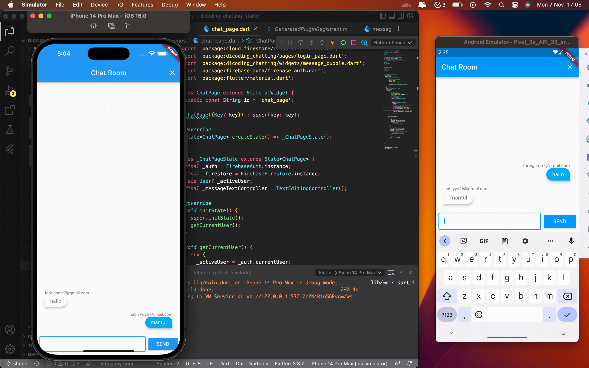

## Description

Projek ini merupakan projek latihan pada modul Firebase di [Belajar Fundamental Aplikasi Flutter](https://www.dicoding.com/academies/195). Pada projek ini mengunakan fitur-fitur pada Firebase seperti Firebase Authentication dan Firebase Firestore.

## Development Setup

Clone the repository and run the following commands:

```
flutter pub get
flutter run
```

## Source

[Dicoding Academy](https://www.dicoding.com/academies/14)

## Screenshot

 
